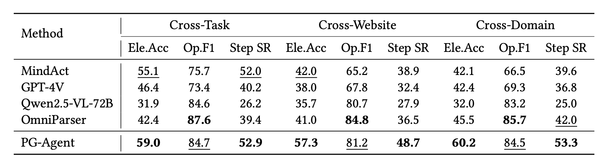
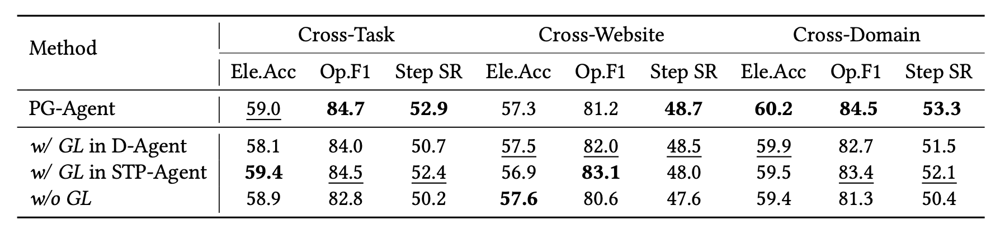
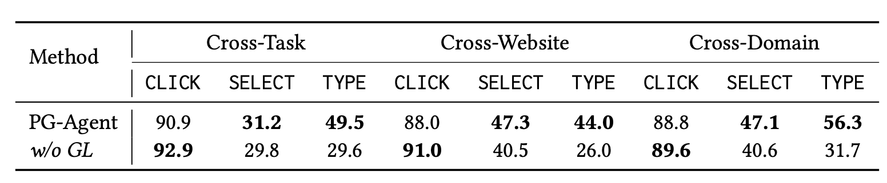

代码见 [GitHub](https://github.com/You-Ao/PG-Agent-rev)

## 环境准备

```bash
pip install langchain langchain-classic langchain-community langchain-huggingface sentence-transformers jax jaxlib peft transformers faiss-cpu
```

!!! warning faiss
    此处选择 `faiss-cpu` 是因为 `faiss-gpu` 需要 `numpy < 2.0`，但 `langchain` 系列包需要 `numpy >= 2.0`，二者冲突，故只能选择 `faiss-cpu`

大模型部分：

曾使用 `API` 进行测试，但 `API` 难以负担整个测试集的训练和评测需求（价格过于昂贵😰）故使用 `vllm` 进行本地部署 `openai` 兼容服务器（借助“计算机视觉导论”课程集群🤗）

环境配置仅需安装 `vllm`: 

```bash
pip install vllm
```
😭 由于集群限制，只能选用模型：`Qwen/Qwen3-VL-30B-A3B-Instruct` 运行在 4 张 `Tesla V100-SXM2-32GB`

vllm 启动命令：

```bash
vllm serve Qwen/Qwen3-VL-30B-A3B-Instruct --tensor-parallel-size 4 --limit-mm-per-prompt.video 0 --async-scheduling
```

可使用 `http://localhost:8000/v1/` 与该模型进行交互

## 代码修改

重写 `chat` 函数，不再自行拼接 `http` 请求发送，使用 `openai` 包发送和接收请求

```python
def chat(img_url_list: list[str] = '', query: str = '') -> dict:
    client = OpenAI(
        api_key="",
        base_url="http://localhost:8000/v1/",
    )

    messages = []
    messages.append({"role": "system", "content": "You are a helpful assistant."})

    content = []
    for img_url in img_url_list:
        content.append({"type": "image_url", "image_url": {"url": f"data:image/jpeg;base64,{encode_image(img_url)}"}})
    content.append({"type": "text", "text": query})

    messages.append({"role": "user", "content": content})
    
    completion = client.chat.completions.create(
        model="Qwen/Qwen3-VL-30B-A3B-Instruct",
        messages=messages,
        stream=False
    )

    response = completion.choices[0].message.content

    # with open("response.txt", "a") as f:
    #     f.write(response)
    #     f.write("\n")

    return response
```

同时修改了图片的发送方式，将图片编码为 `base64` 后进行发送，编码代码如下所示：

```python
def encode_image(image_path):
    with open(image_path, "rb") as image_file:
        return base64.b64encode(image_file.read()).decode("utf-8")
```

由于使用了新版本 `langchain` 包，部分函数在包中的位置被更改，对 `import` 进行修补

```python
from langchain_community.vectorstores.faiss import FAISS
from langchain_classic.schema import Document
from langchain_huggingface import HuggingFaceEmbeddings
```

从 `https://github.com/google-research/google-research/tree/master/android_in_the_wild` 获得文件 `action_type.py`，供 `workflow/` 中的测试文件使用

## 数据集准备

仅针对 `Mind2Web` 数据集进行测试

从 `README.md` 文件指向的网址下载数据集和标注

```
mind2web_images.zip:
https://box.nju.edu.cn/f/33e203d170ab48b0b922/?dl=1
mind2web_annots.zip:
https://box.nju.edu.cn/f/e30b861fa7604668821b/?dl=1
```

## 运行

首先运行 `document_construction/mind2web_document/main.py` 进行训练

训练量与原代码保持一致，为 100，获得文件 `mind2web_library.json`

运行 `workflow/mind2web/mind2web_test.py` 进行测试

选择 `--task test` 共 252 个测试

## 结果

训练得到的结果见文件 `mind2web_library.json`

测试的全部输出见文件 `task_result.txt`

论文中的结果为：



