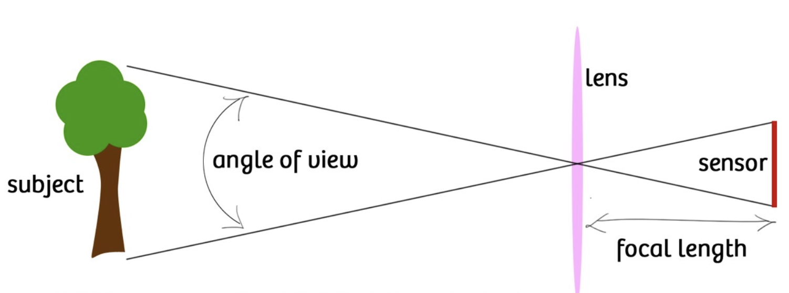
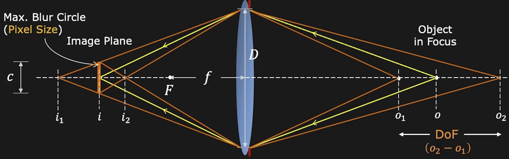

:::warning 未完成
:::

## 线性代数 Linear Algebra

### 矩阵的几何意义

- Scale (缩放)

对于图中的变换，有：

$$
\begin{align}
    x' = sx \\
    y' = sy
\end{align}
$$

写为矩阵形式：

$$
\begin{bmatrix}
    x' \\
    y'
\end{bmatrix}
 = 
\begin{bmatrix}
    s & 0 \\
    0 & s
\end{bmatrix}
\begin{bmatrix}
    x \\
    y
\end{bmatrix}
$$

- Rotation 旋转

这一变换的矩阵表示为：

$$
R_{\theta} = 
\begin{bmatrix}
    \cos \theta & -\sin \theta \\
    \sin \theta & \cos \theta
\end{bmatrix}
$$

上述矩阵中的每一列可以看作原空间的基变换后的结果

即变换后的基为：$(\cos \theta, \sin \theta), (-\sin \theta, \cos \theta)$

## 图像信息 Image Information

### Camera and Lens

#### 透镜

##### 高斯公式

$$
    \frac{1}{i} + \frac{1}{o} = \frac{1}{f}
$$

#### Image Magnification (图像放大率)

$$
Magnification = \frac{h_{i}}{h_{o}} = \frac{i}{o}
$$

根据高斯公式，当 $o \rightarrow \infty$ 时，$f \approx i$，因此焦距越大，图像的放大率越大

#### Field of View (视场角)

在光学仪器中，以光学仪器的镜头为顶点，以被测目标的物像可通过镜头的最大范围的两条边缘构成的夹角，称为视场角

影响因素：

- 焦距 (focal length)

    焦距越长，视场角越小

    焦距越短，视场角越大

- 传感器大小 (sensor size)

    传感器越大，视场角越大

#### Aperture (光圈)

镜头的通光区域，用镜头的直径来表示，记为`D`

##### F-Number

F 数可以通过如下公式计算：

$$
N = \frac{f}{D}
$$

#### Lens Defocus (镜头失焦)

根据相似三角形，有：

$$
\frac{b}{D} = \frac{\left|i' - i\right|}{i'}
$$

因此光斑的大小可表示为：

$$
b = \frac{D}{i'}\left|i' - i\right|, b \propto D \propto \frac{1}{N}
$$

因此，减小光圈可以减小失焦形成的光斑大小

#### Depth of Field (景深)

由于传感器的分辨率有限，在实际使用中，未必需要将像精准地聚焦到传感器上，只要光斑的直径`b`小于像素点的大小，就可以得到较为清晰的像

景深与焦距成**反比**，因此在拍摄人像时，可以选择更大的焦距，更容易地获得背景虚化的效果

::: info 景深公式 (无需记忆)
$$
o_{2} - o_{1} = \frac{2of^{2}cN(o - f)}{f^{4} - c^{2}N^{2}(o - f)^{2}}
$$
:::

### Geometric image formation

#### Perspective Projection (透视投影)

#### Homogeneous coordinates (齐次坐标)

引入齐次坐标，将投影运算转变为线性运算

::: warning
    一个齐次坐标可能对应多个欧式坐标，但它们只有长度上的缩放关系，实际是等价的
:::

##### 齐次坐标中的透视投影

在齐次坐标系中，透视投影可通过线形运算表示，公式如下：

::: important 透视投影公式
$$
\begin{bmatrix}
    f & 0 & 0 & 0 \\
    0 & f & 0 & 0 \\
    0 & 0 & 1 & 0 \\
\end{bmatrix}
\begin{bmatrix}
    x \\
    y \\
    z \\
    1
\end{bmatrix}
= 
\begin{bmatrix}
    fx \\
    fy \\
    z
\end{bmatrix}
= 
\begin{bmatrix}
f\frac{x}{z} \\
f\frac{y}{z} \\
1
\end{bmatrix}
$$
:::