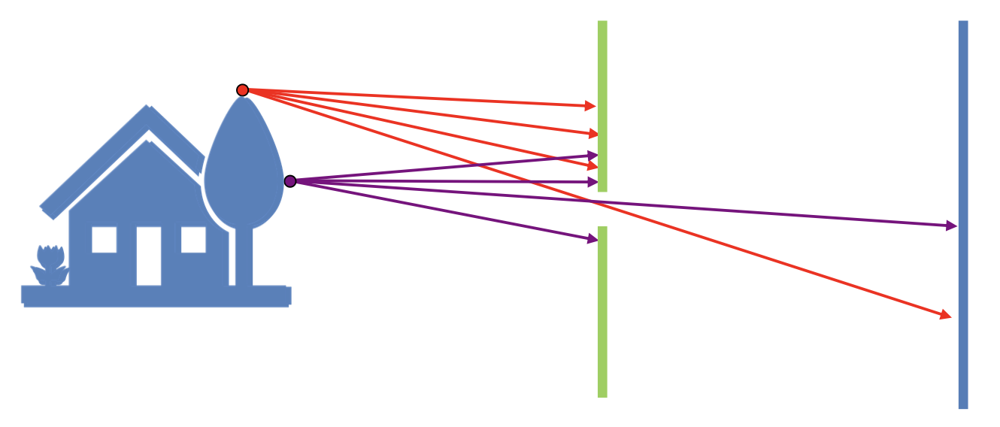
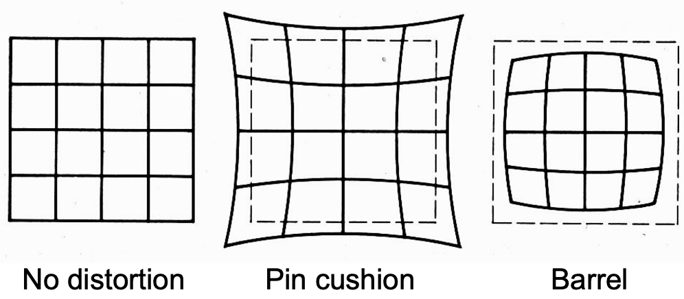
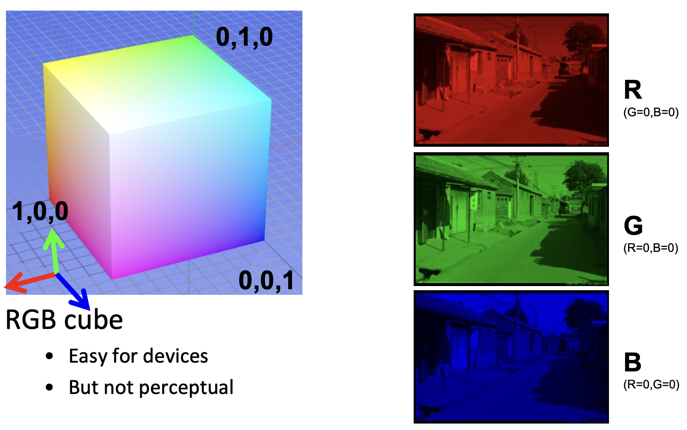
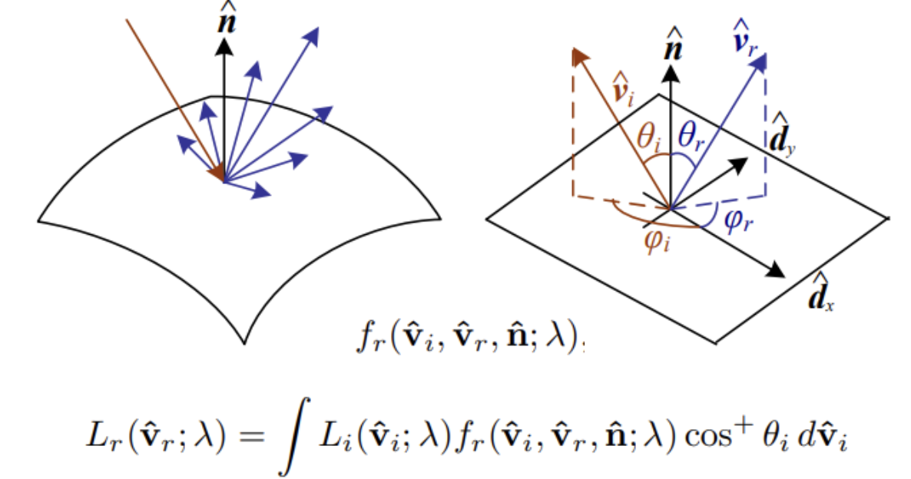

## 线性代数 Linear Algebra

### 线性变换的几何意义

- Scale (缩放)

对于图中的变换，有：

$$
\begin{align}
    x' = sx \\
    y' = sy
\end{align}
$$

写为矩阵形式：

$$
\begin{bmatrix}
    x' \\
    y'
\end{bmatrix}
 = 
\begin{bmatrix}
    s & 0 \\
    0 & s
\end{bmatrix}
\begin{bmatrix}
    x \\
    y
\end{bmatrix}
$$

- Reflection (镜像)

对于水平镜像：

$$
x' = -x
$$

$$
y' = y
$$

转换为矩阵形式：

$$
\begin{bmatrix}
    x' \\
    y'
\end{bmatrix} = 
\begin{bmatrix}
    -1 & 0 \\
    0 & 1
\end{bmatrix}
\begin{bmatrix}
    x \\
    y
\end{bmatrix}
$$

- Shear (剪切)

矩阵表示：

$$
\begin{bmatrix}
    x' \\
    y'
\end{bmatrix} = 
\begin{bmatrix}
    1 & a \\
    0 & 1
\end{bmatrix}
\begin{bmatrix}
    x \\
    y
\end{bmatrix}
$$

- Rotation (旋转)

这一变换的矩阵表示为：

$$
R_{\theta} = 
\begin{bmatrix}
    \cos \theta & -\sin \theta \\
    \sin \theta & \cos \theta
\end{bmatrix}
$$

上述矩阵中的每一列可以看作原空间的基变换后的结果

即变换后的基为：$(\cos \theta, \sin \theta), (-\sin \theta, \cos \theta)$

### 仿射变换 Affine Transformation

仿射变换 = 线性变换 + 平移

矩阵表示：

$$
\begin{pmatrix}
    x' \\
    y'
\end{pmatrix} = 
\begin{pmatrix}
    a & b \\
    c & d
\end{pmatrix} · 
\begin{pmatrix}
    x \\
    y
\end{pmatrix} + 
\begin{pmatrix}
    t_{x} \\
    t_{y}
\end{pmatrix}
$$

笛卡尔坐标系下的仿射变换可以转化为齐次坐标系下的线性变换

矩阵表达如下：

$$
\begin{pmatrix}
    x' \\
    y' \\
    1
\end{pmatrix} = 
\begin{pmatrix}
    a & b & t_{x} \\
    c & d & t_{y} \\
    0 & 0 & 1
\end{pmatrix} · 
\begin{pmatrix}
    x \\
    y \\
    1
\end{pmatrix}
$$

:::info 齐次坐标
关于齐次坐标的内容请参考下文[齐次坐标](#齐次坐标-homogeneous-coordinates)
:::

### 逆变换 Inverse Transform

$$
T^{-1}
$$

从矩阵角度和几何角度来看，$T^{-1}$ 是 $T$ 的逆变换

## 图像信息 Image Information

图像是三维空间的信息在二维空间的映射

### 相机和镜头 Camera and Lens

#### 成像 Image Formation

直接将底片放在物体前无法形成清晰的像，因为此时底片上的一个点会接收到空间中多个点发出的光线，一般来说，只有当图像中的点与物理空间中的点是一一对应的，我们认为这个图像是清晰的

由此，我们引入了 Pinhole Camera Model

##### 小孔相机 Pinhole Camera

其中的隔板可以遮挡大部分光线，中间的小孔叫做光圈 (aperture)

在一定的范围内缩小光圈，可以使图像更清晰，但光圈过小时，会对图像的清晰度产生负面影响，原因为：

- 进光量减小

- 光的衍射

为了解决小孔相机对进光量的影响，我们引入了透镜

#### 镜头 Lens

凸透镜有着和小孔一样的投影效果，但透镜能够聚集光线

##### 高斯公式

$$
\frac{1}{i} + \frac{1}{o} = \frac{1}{f}
$$

i 表示像距，o 表示物距，f 表示焦距

:::info 变焦
包括物理变焦和数码变焦：

- 物理变焦：

    镜头组通过调整透镜来实现改变整体焦距的效果；或直接切换不同的镜头

- 数码变焦：

    镜头的物理焦距没有发生变化，仅仅是通过软件算法实现图像放大

:::

#### 图像放大率 Image Magnification

$$
Magnification = \frac{h_{i}}{h_{o}} = \frac{i}{o}
$$

根据高斯公式，当 $o$ 远大于 $i$ 时 (生活中的大部分情况)，$f \approx i$，因此焦距越大，图像的放大率越大

#### 视场角 Field of View

在光学仪器中，以光学仪器的镜头为顶点，以被测目标的物像可通过镜头的最大范围的两条边缘构成的夹角，称为视场角

影响因素：

- 焦距 (focal length)

    焦距越长，放大率越大，视场角越小

    焦距越短，放大率越小，视场角越大

- 传感器大小 (sensor size)

    传感器越大，视场角越大

因此，图像的视野取决于传感器大小和焦距的比例

:::info 等效焦距
根据传感器的大小归一化后的焦距
:::

#### 光圈 Aperture

镜头的通光区域，通过调整光圈的大小来调整进光量，用镜头的直径来表示，记为`D`

:::info 进光量
进光量不仅可以通过调整**光圈大小**来控制，也可以通过调整**快门时间**来控制
:::

##### F-Number

F 数可以通过如下公式计算：

$$
N = \frac{f}{D}
$$

#### 镜头失焦 Lens Defocus

根据相似三角形，有：

$$
\frac{b}{D} = \frac{\left|i' - i\right|}{i'}
$$

因此光斑的大小可表示为：

$$
b = \frac{D}{i'}\left|i' - i\right|, b \propto D \propto \frac{1}{N}
$$

因此，减小光圈可以减小失焦形成的光斑大小

#### 调焦 Focusing

在镜头和底片的位置确定的情况下 ($f$ 和 $i$ 确定时)，只有在同一垂直平面的物体成像是清楚的，因此，我们需要调焦

调焦的方法包括：调整像平面(image plane)和调整镜头的位置

#### 景深 Depth of Field

由于传感器的分辨率有限，在实际使用中，未必需要将像精准地聚焦到传感器上，只要光斑的直径`b`小于像素点的大小，就可以得到较为清晰的像

景深与焦距成**反比**，因此在拍摄人像时，可以选择更大的焦距，更容易地获得背景虚化的效果

可以通过如下方式来获得背景虚化的效果：

- Large aperture 更大的光圈

- Long focal length 更大的焦距

- Near foreground 更近的前景

- Far background 更远的背景

::: info 景深公式 (无需记忆)
$$
\begin{align}
    c &= \frac{f^2(o - o_1)}{No_1(o - f)} \\
    c &= \frac{f^2(o_2 - o)}{No_2(o - f)} \\
    o_{2} - o_{1} &= \frac{2of^{2}cN(o - f)}{f^{4} - c^{2}N^{2}(o - f)^{2}}
\end{align}
$$
:::

### 几何成像 Geometric image formation

3D 到 2D 空间的投影/几何变换

#### 齐次坐标 Homogeneous coordinates

:::info Pin-hole camera model: Perspective Projection

其中对坐标系的定义为：

三维空间中：镜头的中心位坐标系的原点，水平方向为 $x$ 轴，竖直方向为 $y$ 轴，平行于光轴的方向为 $z$ 轴

二维图像：图像中心 (光轴与像平面的交点) 为原点，水平方向为 $u$ 轴，竖直方向为 $v$ 轴

此处应用像距约等于焦距，从而有 $o \approx f$ (图片中 $f$ 的来源)

图中 $z$ 表示深度

由相似可以得到 
$$
p =
\begin{bmatrix}
    u \\
    v
\end{bmatrix}
=
\begin{bmatrix}
    \frac{fx}{z} \\
    \frac{fy}{z}
\end{bmatrix}
$$

可以看出，在笛卡尔坐标系中，这种投影变换不是线性的

由此引入齐次坐标，将这种投影运算转变为线性运算
:::

笛卡尔坐标转化为齐次坐标

$$
\begin{align}
    (x, y) &\rightarrow \begin{bmatrix}
        x \\
        y \\
        1
    \end{bmatrix} \\

    (x, y, z) &\rightarrow \begin{bmatrix}
        x \\
        y \\
        z \\
        1
    \end{bmatrix}
\end{align}
$$

齐次坐标转化为笛卡尔坐标

$$
\begin{align}
    \begin{bmatrix}
        x \\
        y \\
        w
    \end{bmatrix}
    &=
    \begin{bmatrix}
        \frac{x}{w} \\
        \frac{y}{w}
    \end{bmatrix} \\

    \begin{bmatrix}
        x \\
        y \\
        z \\
        w
    \end{bmatrix}
    &=
    \begin{bmatrix}
        \frac{x}{w} \\
        \frac{y}{w} \\
        \frac{z}{w}
    \end{bmatrix}
\end{align}
$$

::: warning
齐次坐标是缩放不变的

一个齐次坐标可能对应多个笛卡尔坐标，但它们只有长度上的缩放关系
:::

##### 齐次坐标中的透视投影

在齐次坐标系中，透视投影可通过线形运算表示，公式如下：

::: important 透视投影公式
$$
\begin{bmatrix}
    f & 0 & 0 & 0 \\
    0 & f & 0 & 0 \\
    0 & 0 & 1 & 0 \\
\end{bmatrix}
\begin{bmatrix}
    x \\
    y \\
    z \\
    1
\end{bmatrix}
= 
\begin{bmatrix}
    fx \\
    fy \\
    z
\end{bmatrix}
=
\begin{bmatrix}
f\frac{x}{z} \\
f\frac{y}{z} \\
1
\end{bmatrix}
$$
:::

上述公式中：$\begin{bmatrix} x \\ y \\ z \\ 1 \end{bmatrix}$ 表示物体在齐次坐标系下的坐标，$\begin{bmatrix} fx \\ fy \\ z \end{bmatrix}$ 表示像在齐次坐标系下的坐标，$\begin{bmatrix} f \frac{x}{z} \\ f \frac{y}{z} \\ 1 \end{bmatrix}$ 表示像在笛卡尔坐标系下的坐标

###### 透视投影可视化

可以将像平面等效翻转到镜头前

#### 透视投影 Perspective Projection

##### 信息损失

经过透视投影后，由于物体相对于相机的深度信息损失，导致成像中长度、角度等信息会损失，但线的曲直(直线仍然是直的)等信息仍然得到保留

##### 灭点 Vanishing Point

空间直线与成像平面不平行时，该直线在成像平面上的投影为收敛于**灭点**的线段

若空间直线垂直于成像平面，则灭点位于像平面中心

若一组平行线平行于成像平面，则它所成的像依旧平行，即灭点位于无穷远处

由此可以获得空间中的线相对于相机的位置

性质：

- 两条平行线有相同的灭点 `v`

- 相机中心与灭点连成的直线平行于原直线

- 灭点可能在画面外或无限远处

##### 灭线 Vanishing Line

空间平面与成像平面不平行时，该平面在成像平面上的投影为收敛于灭线的区域，相互平行的空间平面在成像空间收敛于同一条灭线

垂直于成像平面的平面对应的灭线在画面中央

灭线与镜头中心所成的平面平行于该平面

该平面中所有直线的灭点都在这条灭线上

同理于灭点，通过灭线可以获得空间中的平面相对于相机的位置

##### 透视畸变 Perspective Distortion

由透视投影的性质引起，与镜头无关

带来的现象有：

- converging verticals

:::details 示例

楼梯形变为梯形，平行线在图像中可相交
:::

- 球体形变为椭圆

球心与镜头中心的连线不垂直于成像平面，且越偏离垂直状态，形变为椭圆的程度越严重

(球面上的各点与镜头中心的连线形成锥形结构，以不垂直于轴线方向切割该锥形，从而得到椭圆)

:::details 示例

:::

#### 径向畸变 Radial Distortion

径向畸变主要由**镜头**的缺陷引起，光线通过镜头边缘的成像更加明显

分为：

- 枕形畸变 Pin cushion

- 桶形畸变 Barrel

**短焦**镜头更容易发生**桶形**畸变，**长焦**镜头更容易发生**枕形**畸变

由于发生了径向畸变，最终成像点的位置不完全符合透视投影中投影点的位置

$$
\begin{align}
    r^2 &= {x^{'}_n}^2 + {{y^{'}_n}}^2 \\
    x^{'}_d &= x^{'}_n(1 + \kappa_1r^2 + \kappa_2r^4) \\
    y^{'}_d &= y^{'}_n(1 + \kappa_1r^2 + \kappa_2r^4)
\end{align}
$$

${x^{'}_n}$ 和 ${{y^{'}_n}}$ 是透视投影中投影点的位置，$x^{'}_d$ 和 $y^{'}_d$ 是发生径向畸变后投影点的位置

#### 正交投影 Orthographic Projection

正交投影可以视为透视投影的特殊情况，当投影中心 (COP) 到投影 (PP) 平面的距离无穷大时，透视投影退化为正交投影

正交投影并没有近大远小的效果

正交投影公式：

$$
\begin{bmatrix}
    1 & 0 & 0 & 0 \\
    0 & 1 & 0 & 0 \\
    0 & 0 & 0 & 1
\end{bmatrix}
\begin{bmatrix}
    x \\
    y \\
    z \\
    1
\end{bmatrix}
=
\begin{bmatrix}
    x \\
    y \\
    1
\end{bmatrix}
\rightarrow
(x, y)
$$

### 光度成像 Photometric Image Formation

描述了三维世界物理性质和二维图像的颜色之间的关系

#### 图像传感器

CMOS：光子 -> 电子 -> 电压

#### 快门 Shutter

##### 快门速度 Shutter speed

快门速度可以控制曝光时间，快门时间过短会导致成像过暗，快门时间过长易导致画面模糊 (相机或物体发生移动)

##### 果冻效应 Rolling shutter effect

快门分为全局快门 (Global shutter) 和 卷帘快门 (Rolling shutter)

对于全局快门，整个传感器同时曝光；而卷帘快门的传感器使用逐行曝光

若卷帘快门进行曝光时，物体快速移动，就可能导致图像中的物体变形，发生果冻效应

#### 色彩空间 Color space

物理世界中，我们使用波长来描述不同颜色的光

在计算机中，我们使用不同的色彩空间对颜色进行描述

- RGB 色彩空间

    红、绿、蓝三种颜色，每个颜色通过 0～255 8bit 的数据进行表示

    

- HSV 色彩空间

  - H: Hue 色相 通过角度表示颜色的种类

  - S: Saturation 饱和度 颜色的纯度

  - V: Value 亮度 表示颜色的明暗程度

    

HSV 色彩空间和 RGB 色彩空间可以相互转换

图片的颜色数据在 python 中以三维矩阵的形式存在 (Height, Width, Channel)

#### 颜色感知 Color Sense

使用拜耳滤镜 (Bayer filter) 来在单个芯片上记录光的颜色

单个芯片智能记录一种颜色的光

四个芯片排列的方形结构记录一个完整的 RGB，绿色滤镜数量更多（人眼对绿色更加敏感）

由于四个芯片才能记录一个完整 RGB，会导致得到图像不连续，需要借助图片差值进行复原

##### 着色

计算机图形学知识，简要了解即可

物体的颜色由物体物体表面反射/折射的光线决定，而这又与物体的材质相关

数学中通过 BDRF 描述物体的材质

上式中 $\hat{v}_i$ 表示入射光线的方向，$\hat{v}_r$ 表示反射光线的方向，$\hat{n}$ 表示表面法向量的方向，$\lambda$ 表示光线的波长，等式左端的结果 $L_r(\hat{v}_r;\lambda)$ 表示以 $\hat{v}_r$ 方向射出的，波长为 $\lambda$ 的光线的强度