## 图像处理基础 Image process basics

:::details 图片的频率
该部分内容参考自 [VCB-Studio 公开教程](https://guides.vcb-s.com/)

可参考这一部分内容来简要了解老师在课程中提到的高频信息、低频信息

图片中像素变化较快，变动幅度大的区域，高频分量占据主导地位。像素变化缓慢，变化幅度小的区域，低频分量占据主导地位。

**平面**：

平面 (flat areas) 是包含大量低频分量的区域，其特点是像素变化非常小。如上图左侧黄框区域。

**线条**：

线条 (lines) 是包含极端高频分量的区域，其像素有跳跃式的急剧变化。如上图中间红框区域。

**纹理**：

纹理 (texture) 区域较为复杂，其像素在小范围内频繁变化，高低起伏不断。纹理变化剧烈的，称之为强纹理，中高频成分占据主导，其性质接近于线条。如上图左侧蓝框区域。纹理变化平缓的，称之为弱纹理，中低频率成分占据主导，其性质接近于平面。如上图右侧绿框区域。

**噪点**：

噪点 (noise) 是一类特殊的画面要素，表现为随机的像素涨落，它可以叠加到以上任意要素中。噪点的频率构成取决于其种类，白噪声在各个频率的强度完全一致，而一般动画原盘所带的噪点则涵盖低频到中高频，随频率增高而略有下降，最高频部分则基本被砍掉。
:::

### 调整图像对比度

提高对比度就是让图片亮的地方更亮，暗的地方更暗

通过 S 曲线实现亮度的重新映射

### 图像颜色反转 invert

$$
out(x, y) = 1 - in(x, y)
$$

### 图像模糊 blur

去除图像中的高频部分

也可以不对边缘进行模糊以实现更“智能”的模糊效果

### 图像锐化 sharpen

增强图像中的高频部分

### 图像边缘检测 edge detection

提取图像中的高频部分

### 卷积 convolution

无需记忆公式，只需要知道卷积核在被卷积的张量上以步长的长度移动即可

在不进行 padding 的情况下，卷积后输出的尺寸为：

$$
\text{Output size} = \lfloor \frac{W - F}{S} + 1 \rfloor
$$

其中 W 表示输入尺寸 (如：长度、宽度)，F 表示卷积核大小，S 表示步长

#### 填充 padding

- Zero values 填充 0

- Edge values 填充边界值

- Symmetric 以与边界的对称方式填充

### 模糊 blur

#### Box Blur

使用卷积完成每个像素与周围像素的均值操作均值操作

#### 高斯模糊 Gaussian blur

二维高斯公式：

$$
f(i, j) = \frac{1}{2\pi\theta^2}e^{-\frac{i^2 + j^2}{2\theta^2}}
$$

卷积核由高斯公式计算得到，其中，使用的高斯公式越平缓 (尖峰部分越矮)，模糊效果越明显

### 锐化 sharpen

I 表示原始图像的信息

图像中的高频信息：

$$
I = I - \mathop{blur}(I)
$$

锐化后的图像信息：

$$
\text{Sharpened image} = I + (I - \mathop{blur}(I))
$$

可行的卷积核：

$$
\begin{bmatrix}
    0 & -1 & 0 \\
    -1 & 5 & -1 \\
    0 & -1 & 0
\end{bmatrix}
$$

### 边缘检测

#### 梯度检测滤波器

垂直边缘检测：

$$
\begin{bmatrix}
    -1 & 0 & 1 \\
    -2 & 0 & 2 \\
    -1 & 0 & 1
\end{bmatrix}
$$

实际的卷积核形状也更像垂直边缘 (左黑右白)

水平边缘检测：

$$
\begin{bmatrix}
    -1 & -2 & -1 \\
    0 & 0 & 0 \\
    1 & 2 & 1 
\end{bmatrix}
$$

实际的卷积核形状更像水平边缘 (上黑下白)

由此可以看出，使用卷积核对图像进行卷积操作时，与卷积核形状更相似的部分会产生更大的相应

#### 双边滤波器 Bilateral filter 

了解即可

在保留边缘的情况下，对图像的其他部分进行高斯模糊以实现去噪

## 图像采样 Image sampling

### 图像分辨率

图像包含像素尺寸和物理尺寸

像素尺寸顾名思义，单位为像素，不具有物理意义上的大小含义

物理尺寸，表示图像的物理大小，单位可为英寸 (inch)

这二者之间的联系即为**分辨率** (resolution)，单位为像素每英寸 (pixels/inch, PPI)

### 降采样 Down sampling

能减小图片的大小

每隔一点采样一次，可以实现将图像的大小缩小为原来的一半

同时也会造成一些信息的丢失，出现混叠现象

#### 混叠 Aliasing

由于信号变化的频率过快或采样的频率过低导致

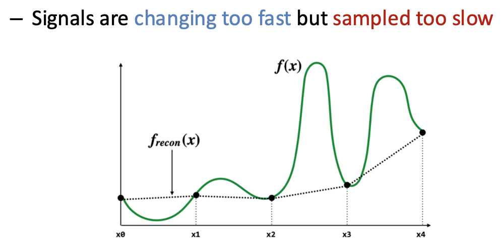

:::details 可能造成的情况
- 摩尔纹 (Moiré patterns)

- 车轮错觉 (wagon wheel illusion)
:::

对于不同频率的信号使用相同采样率的结果：

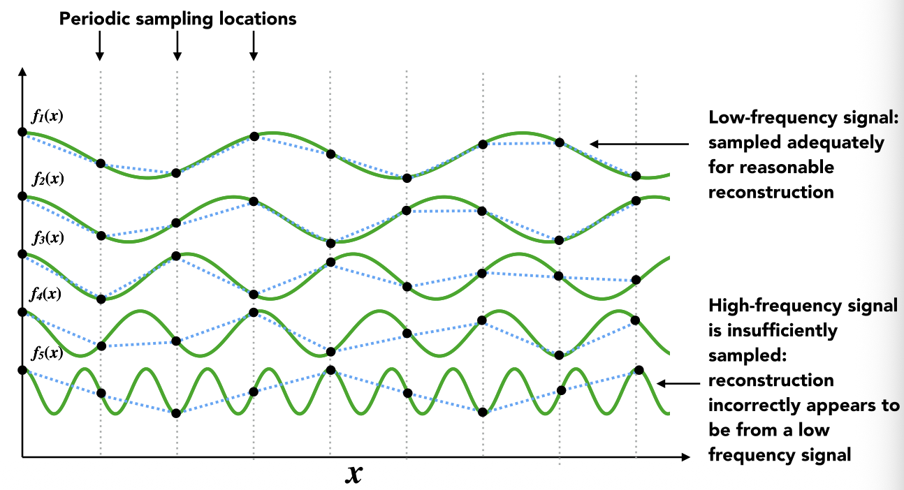

#### 傅立叶变换 Fourier Transform

将一个信号表示为一组正弦/余弦函数的加权求和 (线性组合)，其中的权重能够表示该频率在原有信号中所占的比例

将其中的权重绘制成上图所示的直方图，即为该信号的频谱

正向变换：

$$
F(u) = \int_{-\infty}^{\infty}f(x)e^{-i2\pi ux}dx
$$

根据欧拉公式：

$$
e^{i\theta} = \cos{\theta} + i\sin{\theta}
$$

其中的 $e^{-i2\pi ux}$ 可视作频率为 $u$ 的正弦或余弦函数

逆向变换：

$$
f(x) = \int_{-\infty}^{\infty}F(u)e^{i2\pi ux}du
$$

可以理解为通过加权求和将频谱还原为原来的信号

##### 卷积定理

空间域中两个信号的卷积等价于频域中两个信号的乘积；同理，空间域中两个信号的乘积等价于频域中两个信号的卷积

图中频域的 $G(u) \; F(u) \; H(u)$ 均表示空间域中 $g(x) \; f(x) \; h(x)$ 经过傅立叶变换得到的频谱

由此可得，卷积操作也可以通过傅立叶变换后由成绩操作实现

##### 二维傅立叶变换

上图表示二维的图片经过傅立叶变换得到的频谱

右图中心表示频率低的信号，由中心向四周，频率逐渐增大，其中水平和竖直方向的坐标分别表示各自方向上的频率

#### 二维卷积定理

示例图：

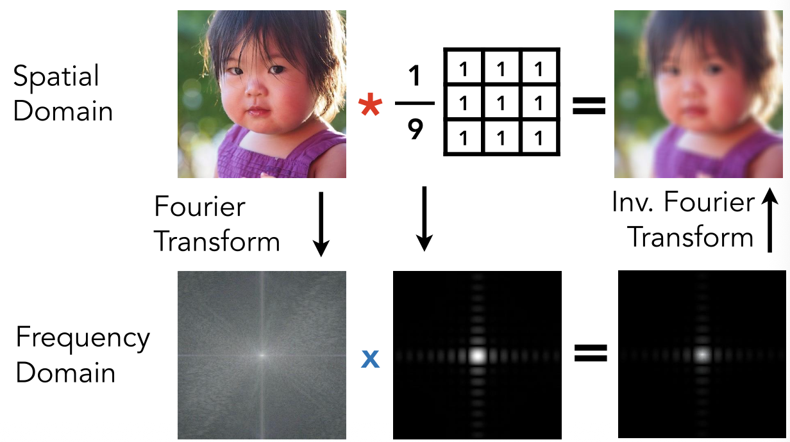

频域中二者的直接相乘可以直观的看出，中心的低频部分被保留，而边缘的高频部分被去除，从而实现了 box bluring，这也是卷积被称为**滤波**的原因

均值滤波和高斯滤波都是低通滤波器 (low-pass filter)

卷积核越大，频域越窄

#### 总结

采样信号等价于在空间域中将信号与采样函数 (周期脉冲函数/周期狄拉克函数 Dirac comb function) 相乘

其从空间域到频域到傅立叶变换如下图所示：

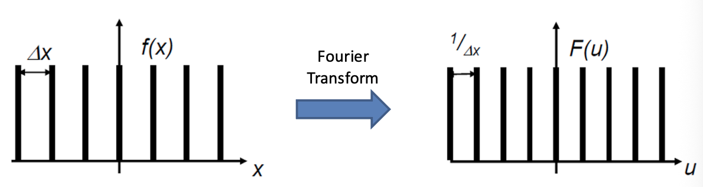

该函数在空间域的周期为 $\delta x$，则在频域下的周期为 $\frac{1}{\delta x}$

由此可得空间域与频域下的采样情况：

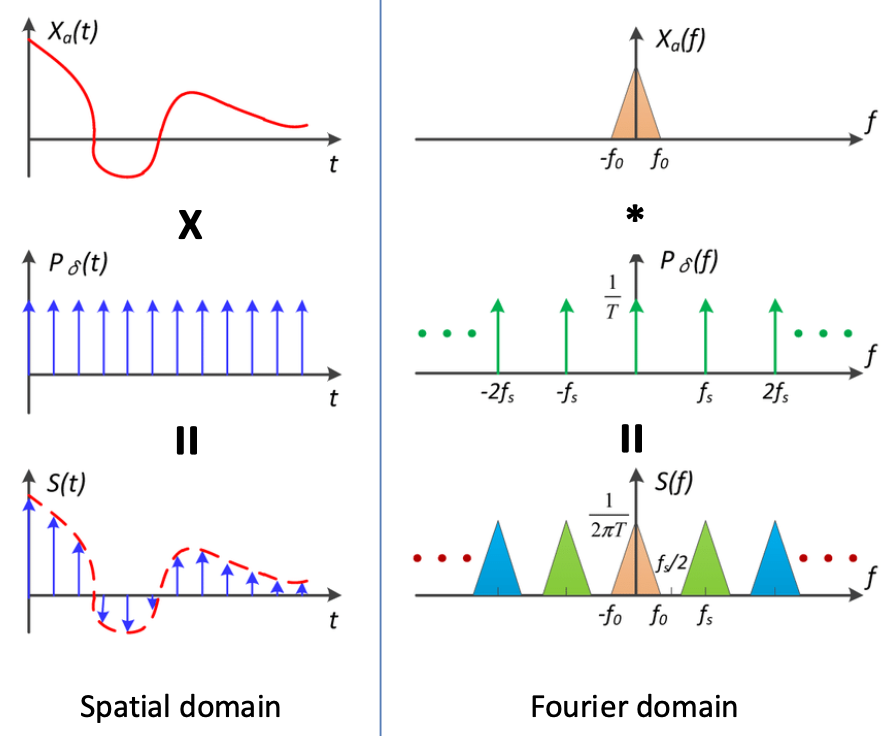

在采样频率足够大时，右图中采样得到的三角形不会重叠，若采样频率过小，则三角形会发生重叠，此时即发生了混叠 (aliasing)，信号失真，无法通过采样后的信号还原原来信号的频谱，若要不发生失真，则 $f_s \gt 2f_0$，即奈奎斯特-香农定理

##### 奈奎斯特-香农定理 Nyquist-Shannon theorem

只有采样频率大于二倍信号频率 ($f_0$)，信号才可以根据采样结果被完美重建

#### 减少混叠

1. 增加采样频率

2. Anti-aliasing

    改变原来信号的频谱，在采样前使用低通滤波器减少一部分图像的高频部分

:::details 示例
可以通过 Anti-anliasing 减少锯齿和摩尔纹的出现

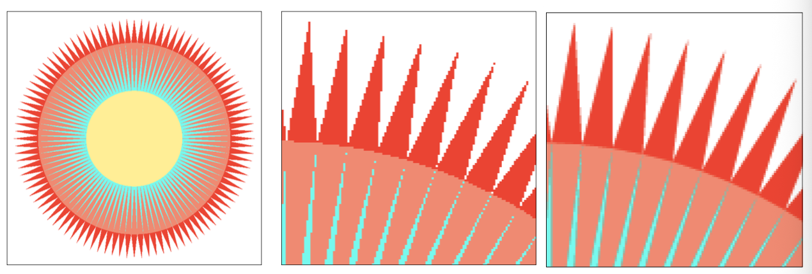

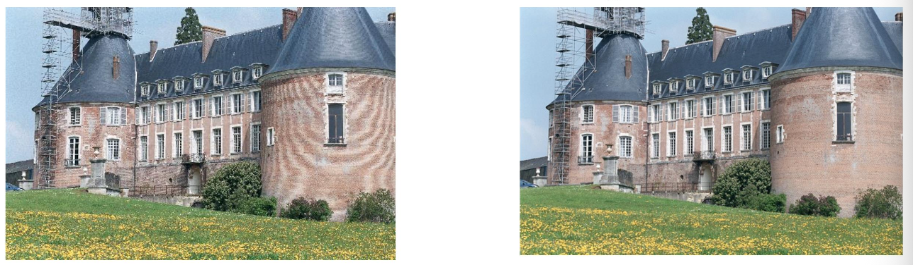
:::

## 图像放大 Image magnification

### 上采样 Up sampling

需要通过插值 (Interpolation) 来补充缺少的信息

#### 插值 Interpolation

一维插值方法：

**最近邻插值 Nearest-neighbor interpolation**

得到的结果不连续、不光滑

**线性插值 Linear interpolation**

得到的结果连续、不光滑

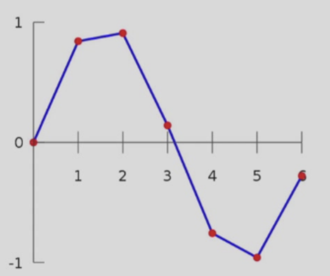

**多项式插值 Cubic interpolation (三次多项式)**

得到的结果连续、光滑

对每一段使用不同的多项式进行插值

二维插值方法：

**双线性插值 Bilinear interpolation**

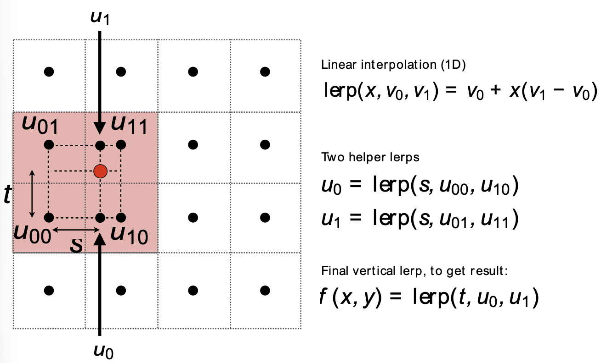

**双多项式插值 Bicubic interpolation (三次多项式)**

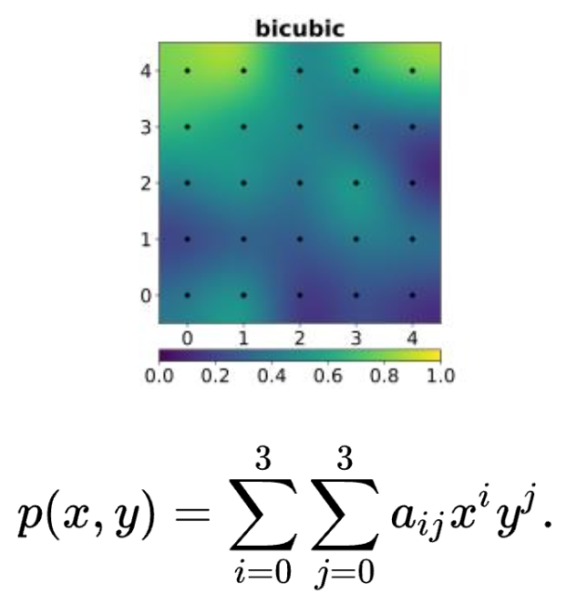

效果对比：

#### 超分辨率 Super resolution

插值没有获得多余的信息，所以处理后仍然具有瑕疵，可以使用神经网络，通过超分辨率技术获得更多的信息，从而获得更好的效果

## 改变图像宽高比 Changing aspect ratio

直接压缩会导致画面内容发生畸变，直接剪切可能会导致画面中重要的信息丢失

可行的方案：

删去图片中不重要的部分 (与周围像素接近的部分)

使用边缘能量 (edge energy) 作为衡量指标：

$$
E(I) = \left| \frac{\partial I}{\partial x} \right| + \left| \frac{\partial I}{\partial y} \right|
$$

通过卷积的方式进行求导，使用的卷积核为边缘检测卷积核

接缝裁剪 (seam carving)：自顶向下寻找一条使像素边缘能量最小化的连接路径

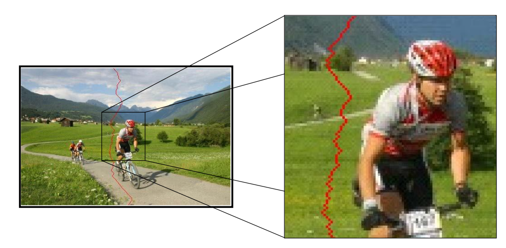

使用动态规划的最短路径思想求解

$$
M(i, j) = E(i, j) + min(M(i - 1, j - 1), M(i - 1, j), M(i - 1, j + 1))
$$

也可以通过接缝插入 (seam insertion) 来放大图像：

