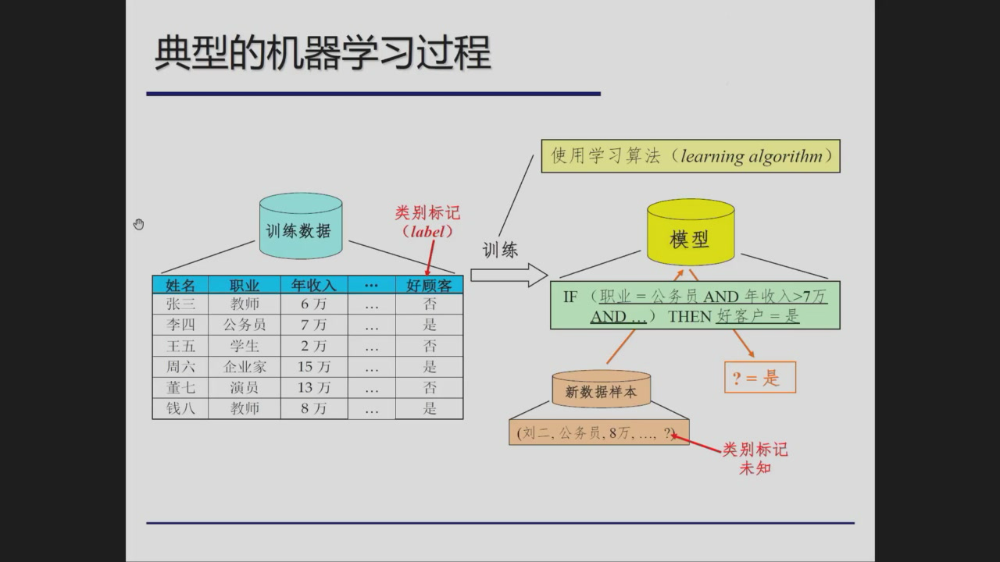
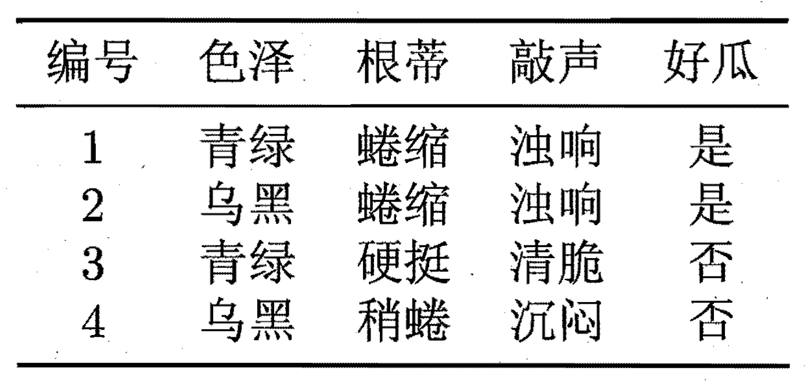
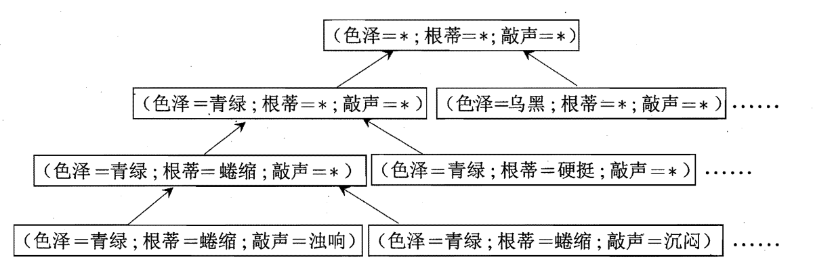
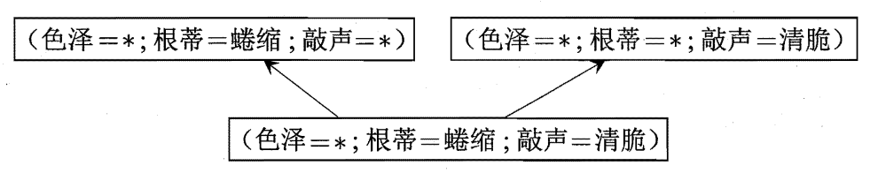
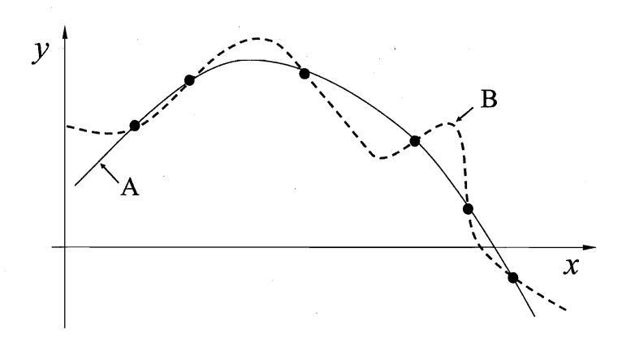

## 机器学习导论

### 定义

以数据为经验的载体，利用经验数据不断提高性能的计算机系统/程序/方法

### 典型的机器学习过程

## 基本术语

:::info 学习过程
学习过程就是得到输入到输出的预测模型
:::

### 数据

- 特征: 用来描述数据的可测量或可识别的属性或特性
  
    :::info 特征 
    又称为属性、变量、输入

    数据中的每一列(除了我们想要预测的目标列)通常就是一个属性

    每一个特征代表了观察对象的一个特定方面的信息
    :::

- 特征值: 特征的离散取值或连续取值

- 样本维度(Dimensionality): 特征个数

- 特征张成的空间: 属性空间/特征空间/输入空间

- 标记张成的空间: 标记空间/输出空间

- 示例(Instance)/样本(Sample): 一个对象的输入，**示例不含标记**

- 样例(Example): 示例+标记
  
    :::important 标记、样例
    标记表示模型的输出，又称目标变量、响应变量

    样例表示一个完整的数据单元，包含特征(输入)和标记(输出)
    :::

- 训练集 = 一组训练样例

- 测试集 = 一组测试样例

### 预测任务

- 根据标记的取值情况可以分为:
  
    - 分类任务: 标记为离散值

      - 二分类: 例如 (好瓜，坏瓜) (正类，反类) (+1, -1)

      - 多分类: 例如 (冬瓜，南瓜，西瓜)

    - 回归任务: 标记为连续值，例如瓜的成熟度

    - 聚类任务: 标记为空值，对示例进行自动分组，例如本地瓜、外地瓜

- 根据标记的完整情况可以分为:

    - (有)监督学习: 所有示例都有标记

      - 分类、回归

    - 无监督学习: 所有示例都没有标记

      - 聚类

    - 半监督学习: 少量示例有标记，大量示例没标记

    - 噪声标记学习: 标记有，但不完全准确

    - ...

### 目标

机器学习技术的根本目标是**泛化能力**

由于未来不可知，一般依靠历史数据来逼近模型的泛化能力

这一理论基于 I.D.D. 假设：历史和未来来自相同分布

:::info I.D.D.
独立同分布(independent and identically distributed，I.D.D.): 

指随机过程中，任何时刻的取值都为随机变量，如果这些随机变量服从同一分布，并且互相独立，那么这些随机变量是独立同分布。
:::

### 概念学习

最理想的机器学习是学习到**概念**（人类可学习、可理解的）

现实中很困难，很多时候采用的是**黑盒模型**

#### 假设空间

对于上述数据集，若学习的目标是“好瓜”，则可将假设空间表示为：

$$
{好瓜} \leftrightarrow (色泽 = ?) \land (根蒂 = ?) \land (敲声 = ?)
$$

当“色泽”“根蒂”“敲声”分别有3、2、2种可能取值，则该假设空间的规模大小为 $4 \times 3 \times 3 + 1 = 37$

:::important 假设空间规模计算
在计算假设空间规模时，需要考虑与该特征无关的情况

因此上式中的4、3、3均由特征的可能取值数加1得到，最终的加1则来自于与所有特征都无关的情况
:::

#### 版本空间

学习的过程是对假设空间中的错误假设进行删除，由于假设空间很大，训练集有限，因此可能存在多个假设与训练集一致，即**版本空间**（与训练集一致的假设集合）

#### 归纳偏好

机器学习算法在学习过程中对某种类型假设的偏好，任何一个有效的机器学习算法必有其归纳偏好

例如：算法可能喜欢"尽可能特殊"的模型，也可能喜欢"尽可能一般"的模型

#### NFL 定理

No Free Lunch (没有免费的午餐) 定理

一个算法$\mathfrak{L}_a$如果在某些问题上比另一个算法$\mathfrak{L}_b$好，必然存在另一些问题$\mathfrak{L}_b$比$\mathfrak{L}_a$好

在实际使用中，我们可能只注意问题的某些情况，因此，脱离具体问题，谈哪些算法更好毫无意义

